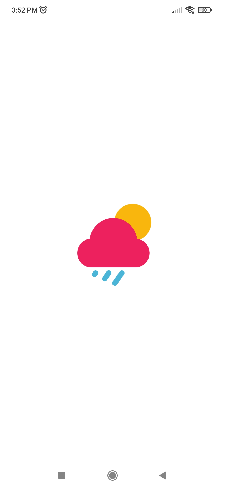
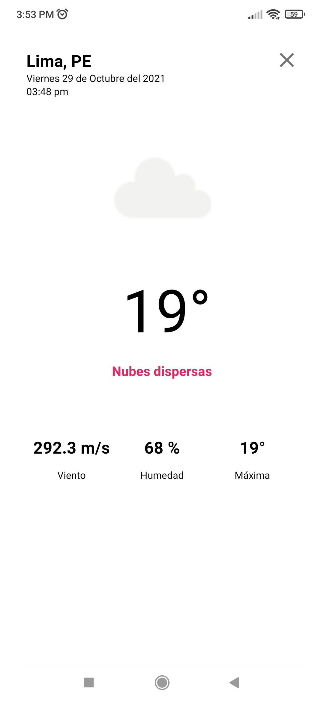

Weather App
===========

# Descripción
Es una aplicación para visualizar el clima de tu ciudad.

# Funcionalidades
La aplicación tiene una buscador de ciudades y de la lista se puede ingresar a cada una para
saber el clima.

# Capturas de pantallas
<kbd>
  
  
  
</kbd>

# Architectura
Está desarrollado con la arquitectura CLEAN, que contiene 3 paquetes:

* Data: Está la implementación de los repositorios y el almacenamiento local con Room y conexión con servicios.
* Domain: Están los casos de uso y repositorios.
* Presentation: Están los fragmentos, actividades y ViewModel

# Librerías
Se usó las siguientes librerías:

* Timber - Para el manejo de logs.
* Koin - Para inyección de dependencias.
* Retrofit - Para la conexión con los servicios.
* Navigation - Para la navegación de pantallas
* Chucker - Para visualizar las solicitudes de los servicios.
* Room - Para el almacenamiento local.
* Coroutines - Para procesos en segundo plano
* Stetho - Para visualizar el almacenamiento local
* Coil - Para las carga de imágenes

# API de Clima
Para obtener los datos de clima se usó el API de Open Weather https://openweathermap.org/api

# Proceso de compilación
Para compilar require poner su KEY de Open Weather en el parámetro `open_weather_api_key` del archivo `gradle.properties`